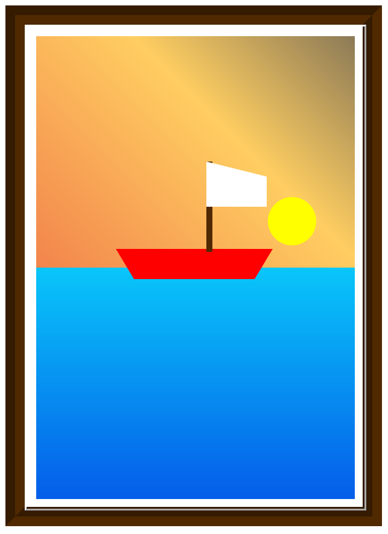

# HTML & CSS Layouting

This project is about positioning and layout via HTML and CSS and is shown via a picture frame of a boat on water with an animated sun and sunset.  

More can be done with this in the future, such as responsive design and adding and animating fish to the image.

Commenting has been added to the CSS file to explain what is being done.

